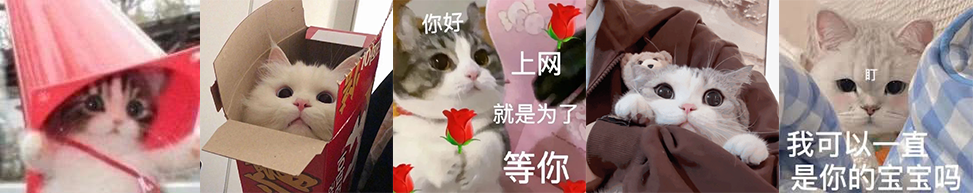
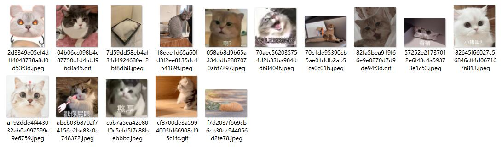
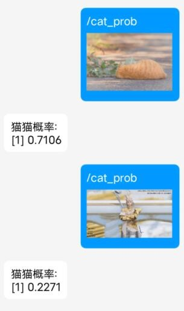

# MoreCats



# 简介

你还在为自己的猫图不够多而烦恼吗？你还在为群太多水不过来而漏存猫猫图而感到无力吗？快来试试这款~~全自动赛博捕猫器~~猫猫识别机器人吧！

使用`ResNeXt50_32x4d`预训练模型迁移训练而来，识别速度40ms（CPU），准确率98.56%。

因为训练用的数据集中负样本（即非猫猫）是从PC端QQ自动保存的图片缓存中选取的，含有大量个人隐私信息，暂不开源。

P.S. 不看我还不知道，群友们也太能发色图了，缓存里色图比猫猫图还要多……

# 功能

- [x] 识别猫猫（可输出概率，使用/cat_prob+图片）
- [x] 保存猫猫
- [x] 随机猫图
- [ ] 计算群内猫猫浓度
- [ ] 本群猫图渣男排行榜
- [x] 猫图去重（基于NeuralHash）
- [ ] OCR文字识别

其他新奇功能有待实现，欢迎提交PR！

# 示例

## 自动保存



## 概率输出



# 用法

不建议作为NoneBot2插件附加到现有机器人之上，因为推理是阻塞操作，在接收到大量图片时，可能会大幅影响整体的消息处理效率。

建议使用Docker单独启动，在go-cqhttp中添加反向ws即可。

## 直接启动

首次运行请先运行以下命令安装依赖：

```shell
pip install -r requirements.txt
```

然后使用以下命令启动：

```shell
python3 bot.py
```

## docker-compose（推荐）

```shell
sudo docker-compose up -d --build
```

## 其他

参考NoneBot文档的[部署](https://v2.nonebot.dev/docs/tutorial/deployment)

# 配置项

一切配置均通过环境变量进行配置，直接运行时可通过.env文件进行配置。

涉及到本机器人实现功能的配置项如下：

|变量名|类型|默认值|说明|
|-----|----|-----|---|
|CAT_IMAGE_DIR|String|None|猫猫图的存储路径，为空则仅识别不保存|

# go-cqhttp参考配置

```yaml
servers:
  - ws-reverse:
      universal: ws://127.0.0.1:8080/onebot/v11/
      reconnect-interval: 3000
      middlewares:
        <<: *default
```

# 许可证

> THE SOFTWARE IS PROVIDED "AS IS", WITHOUT WARRANTY OF ANY KIND, EXPRESS OR
IMPLIED, INCLUDING BUT NOT LIMITED TO THE WARRANTIES OF MERCHANTABILITY,
FITNESS FOR A PARTICULAR PURPOSE AND NONINFRINGEMENT. IN NO EVENT SHALL THE
AUTHORS OR COPYRIGHT HOLDERS BE LIABLE FOR ANY CLAIM, DAMAGES OR OTHER
LIABILITY, WHETHER IN AN ACTION OF CONTRACT, TORT OR OTHERWISE, ARISING FROM,
OUT OF OR IN CONNECTION WITH THE SOFTWARE OR THE USE OR OTHER DEALINGS IN THE
SOFTWARE.